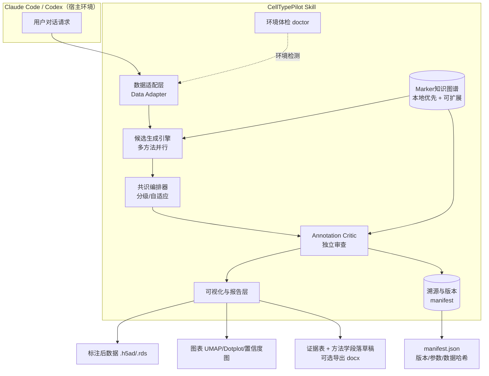

# CellTypePilot 设计方案与架构

> Single-cell annotation intelligence layer for coding agents
> 版本:v0.1(草案) · 面向:Claude Code / Codex 插件形态 · 目标用户:个人研究者 / 小型课题组

---

## 一、产品定位

**一句话定位**:CellTypePilot 不是又一个细胞注释算法,而是一个"挂载在你已经在用的 Claude Code / Codex 上"的单细胞注释可信度层——让没有生信核心支持的个人研究者,能在自己熟悉的编码 agent 里,拿到有证据、有把关、能直接写进论文的注释结果。

**核心差异化不在"算法多准",而在三件事**:

1. **零迁移成本**:不需要换到独立的科研工作台 App,不需要学新的界面,就在你已经打开的 Claude Code / Codex 会话里跑起来。
2. **入门摩擦极低**:不需要预先配置一堆 MCP、不需要懂 pixi/conda 环境管理,`git clone` 一下就能跑出基础结果,高级功能按需渐进解锁。
3. **产出闭环到"可投稿"**:不是给你一个标签,而是给你标签 + 证据 + 置信度 + 图 + 方法学段落草稿,一条龙到可以直接用的产出。

---

## 二、真实痛点(不是泛泛而谈)

单细胞注释本身"耗时、主观"是老生常谈,但对个人研究者/小课题组这个具体人群,真正卡住他们的是以下几点,而这些恰恰是现有方案(无论开源学术工具还是官方平台)都没有专门为这个人群解决的:

| 痛点 | 具体表现 | 为什么现有方案没解决好 |
|---|---|---|
| 没有人把关 | 注释结果对不对,没有"上级/同事"能帮忙审一遍 | 学术开源工具给你一个标签和置信度分数,但很少给出"为什么该怀疑这个结果"的可操作反馈 |
| 配置门槛高 | 想用现成的 Claude Code skill,先要配 MCP、装环境、搞懂 AnnData 结构 | 现有 Claude Code skill(如 quadbio 方案)面向的是已经具备生信工程能力的用户 |
| 工作流割裂 | 数据在 Scanpy/Seurat 脚本里,注释工具却要求换一个独立 App | Claude Science 等官方工作台是独立应用,需要专门切换过去、上传数据 |
| 说不清"为什么" | 写论文/答辩被问"这个cluster为什么叫这个名字",答不上来 | 大多工具只给最终标签,证据链不完整或不好复用成文字 |
| 罕见/过渡态处理粗暴 | doublet、过渡态、非模式物种细胞类型,被强行塞进一个标签 | 多数工具默认每个cluster必须有一个确定标签,不擅长表达"这里不确定" |
| 成本失控 | 想用多模型共识提高准确率,但对每个cluster都跑一遍很烧token | 现有多LLM共识方案(如 mLLMCelltype)通常对所有cluster统一跑同等强度的推理 |
| 结果不可复现 | 半年后审稿人要复现结果,自己也说不清当时用的哪版数据库/哪个模型 | 少有工具默认记录版本化的证据来源和运行环境快照 |

---

## 三、竞品格局与站位

先诚实地摆一下现状,这决定了 CellTypePilot 不能往哪个方向做:

- **学术开源工具**(mLLMCelltype 多LLM共识、CyteType 多agent证据注释、ReCellTy 知识图谱检索增强、scMarkerAgent 大规模文献marker图谱等):功能强,但普遍面向有生信基础的用户,论文导向、工程打磨有限。
- **quadbio/cell-type-annotation**:已经是一个专门给 Claude Code 用的证据驱动注释 skill,marker/本体/文献证据 + critic子agent 审查,思路和 CellTypePilot 高度重合,但需要配置 BioContextAI Knowledgebase MCP 等依赖,对入门用户不算友好。
- **Anthropic 官方 Claude Science**:独立科研工作台 App,预置60多个技能覆盖单细胞等领域,支持产出发表级图表和全流程溯源——这正是我们原本想做的差异化点,官方已经在做。

**结论**:算法准确率、证据图谱规模这些"硬指标"上,单打独斗很难赢过学术界持续的论文产出和官方平台的资源投入。CellTypePilot 的生存空间在于**分发形态和使用门槛**——做一个"寄生"在用户已有 Claude Code / Codex 工作流里的轻量层,而不是又一个独立平台或重工程 skill。

---

## 四、总体架构



---

## 五、核心模块详细设计

### 5.1 数据适配层(Data Adapter)

- 输入:`.h5ad`(优先支持)、`.rds`(通过桥接脚本)、10x原始矩阵目录
- 自动探测:物种(基因命名规律)、组织类型(如已有metadata则直接读取,否则询问用户或留空走通用marker库)、测序技术(scRNA-seq / CITE-seq / 空间转录组,决定后续证据权重)
- 找不到必要字段(如cluster key)时,不报错退出,而是列出候选字段让用户选,降低"跑不起来"的挫败感

### 5.2 Marker Knowledge Graph(核心资产)

数据模型(简化):

```
CellType(cell_ontology_id, name, synonyms[])
Marker(gene_symbol, species)
Tissue(name)
Edge: CellType --marked_by(polarity: positive/negative, specificity_score)--> Marker
Edge: CellType --observed_in--> Tissue
Provenance: source(数据库/文献), evidence_snippet_ref, confidence_tier, kg_version
```

- **默认离线核心库**:精选公开资源(如 PanglaoDB、CellMarker、公开参考图谱)的一个轻量子集,覆盖人/鼠常见组织,随插件内置,不需要联网、不需要API key就能跑基础结果
- **可选扩展包**:联网拉取更大规模的图谱扩展(罕见细胞类型、疾病态、非模式物种),按需下载,不强制
- **版本化发布**:每次核心库更新打版本号(如 `mkg-2026.08`),每次运行记录用的是哪个版本,保证半年后能复现同样的结果

### 5.3 候选生成引擎(多方法并行,而非多模型堆叠)

三条低成本路径并行跑,谁便宜先跑谁:

1. **确定性marker打分**(无LLM调用):基于差异表达基因和知识图谱做重叠度/特异性打分,零成本、可复现
2. **参考图谱映射**(可选,若本地有缓存的参考数据集):传统的label transfer方法
3. **单次LLM推理**:把top差异基因 + 知识图谱上下文喂给一个性价比模型,输出候选标签、理由、初步置信度

这一层输出的是**候选集合**,不是最终答案——真正决定要不要花更多钱去争论的,是下一层。

### 5.4 共识编排器(成本控制的关键差异化)

这是 CellTypePilot 相对 mLLMCelltype 这类"对所有cluster统一跑多模型共识"方案的核心工程差异:

- **Tier 0(默认)**:如果 marker打分法 和 单次LLM推理 结果一致、且没有相互矛盾的负向marker出现 → 直接采纳,不再升级
- **Tier 1(仅对存疑cluster触发)**:出现以下情况才升级到多模型辩论/投票——候选标签前两名分数接近、负向marker冲突、置信图谱覆盖稀疏(罕见类型/非模式物种)
- 升级成本只花在真正需要的cluster上,而不是均匀撒给所有cluster,这是控制token开销、让个人用户"用得起"的关键设计

### 5.5 Annotation Critic(信任层,产品的灵魂)

不是简单复述置信度分数,而是做一次**独立的、带怀疑态度的审查**:

- **证据充分性检查**:阳性marker的表达比例、fold change、跨cluster特异性是否真的支撑这个标签
- **负向marker冲突检查**:该标签理论上不该表达的marker,是否在这个cluster里异常偏高
- **Doublet/混合信号启发式**:两组互斥谱系marker同时显著共表达时,主动提示"疑似doublet或混合群体",而不是强行给一个标签
- **本体一致性检查**:输出标签是否为合法的 Cell Ontology 术语、是否符合组织/谱系上下文,防止模型编造不存在的细胞类型名
- **结构化置信度分级**:高/中/低/需人工复核,每一级都配一段面向初学者的自然语言解释(这既是审查结果,也是教学材料,方便用户在论文答辩时讲清楚"为什么这么标注")

### 5.6 溯源与版本管理

每次运行生成一份 `manifest.json`:知识图谱版本、用到的模型及版本、输入数据哈希、运行参数、时间戳。目的:

- 审稿人/合作者要求复现时,直接照 manifest 重跑
- 半年后自己也能说清楚当时是怎么标的

### 5.7 可视化与报告层

标准产出:

- UMAP(按细胞类型着色,统一配色方案,兼顾色盲友好)
- Marker Dotplot(细胞类型 × marker基因)
- 置信度可视化(哪些cluster是高置信度、哪些需要人工复核,一眼看出)
- 可选:跨样本/条件的细胞类型比例堆叠图

**"投稿包"模式**(与 docx/pptx 生成能力打通,这是开源工具普遍缺的最后一公里):自动打包证据表 + 图 + 图注草稿 + 方法学段落草稿,直接导出可编辑的 Word 文档。

> 注:你提到想做的"类似 Motif 插件"的可视化功能,目前我还没拿到具体的功能细节(仓库无法访问、作者主页也未再列出该项目),这一节的可视化清单是基于"个人研究者最终要交的是论文图"这个真实需求推导出来的默认方案。等你确认 Motif 具体长什么样,我们再对照补齐或调整这里的具体交互设计。

### 5.8 入门友好的工程范式(借鉴 Proteus 模式)

- 一行 `git clone` 装进 `~/.claude/skills/` 或 `~/.codex/skills/`,不强制配置
- 内置 `doctor` 脚本:一键检测环境(Python版本、scanpy/anndata是否装、API key是否配置),清楚告诉用户"当前能跑哪些功能、缺什么会降级成什么样",而不是运行时报错
- 核心路径(Tier 0)只依赖轻量库就能出基础结果,高级功能(扩展知识图谱、多模型共识、docx导出)按需渐进解锁
- 支持 `--json` 输出,方便宿主agent(Claude Code/Codex)拿到结构化结果继续做下一步推理或调用其他工具

---

## 六、典型工作流(用户视角)

```
# 1. 首次使用,环境体检
$ celltypepilot doctor

# 2. 跑注释(物种/组织可自动探测或交互式确认)
$ celltypepilot annotate --input data.h5ad --cluster-key leiden

# 输出:
#   data.annotated.h5ad         带注释结果的数据
#   evidence_table.csv          每个cluster的证据明细
#   figures/                    UMAP、dotplot、置信度图
#   manifest.json               版本与运行参数快照
#   report_draft.docx（可选）   证据+图+方法学段落草稿

# 3. 对某个被critic标记的可疑cluster深挖
$ celltypepilot critic --focus cluster_7
```

---

## 七、MVP 与分期路线图

- **Phase 1(MVP)**:h5ad适配 + 内置核心marker图谱(人/鼠常见组织)+ marker打分 + 单次LLM推理 + 基础critic(证据充分性 + 负向marker冲突)+ doctor脚本 + JSON输出 + 基础UMAP/dotplot。**不做多模型共识**——先把"信任层"做扎实,这是最独特、成本最低的差异化点。
- **Phase 2**:分级共识编排器(仅对存疑cluster升级)+ doublet启发式检测 + Cell Ontology一致性检查 + 扩展物种/组织覆盖
- **Phase 3**:docx/pptx投稿包生成 + manifest/版本管理打磨 + Seurat/R支持 + 可选参考图谱映射方法接入
- **Phase 4(商业化探索)**:知识图谱扩展包订阅、课题组共享marker库与版本管理、非模式物种/罕见类型的定向文献挖掘请求

---

## 八、成本控制策略

- 分级共识:只对存疑cluster升级到多模型辩论,而不是对所有cluster一视同仁地烧token
- 免费的确定性marker打分作为第一道过滤,能不调LLM就不调
- 本地缓存:相同cluster签名、相同知识图谱版本的查询结果直接复用
- 默认用性价比模型做第一遍,多模型升级作为用户可选的"高置信度模式"

---

## 九、风险与应对

| 风险 | 应对思路 |
|---|---|
| Claude Science 覆盖面持续扩大,挤压独立插件空间 | 坚持"轻量寄生在用户已有agent里"的错位打法,不与官方独立工作台正面竞争 |
| 开源社区方案(quadbio skill、mLLMCelltype等)持续免费迭代 | 差异化在"入门摩擦更低 + critic更贴近个人科研工作流 + 产出闭环到投稿材料",不拼算法跑分 |
| 知识图谱维护是持续性成本,数据会过时 | 版本化发布 + 清晰标注每条证据的置信度来源,不追求大而全,先保证核心组织/物种的质量 |
| 单细胞是小众领域,付费意愿存疑 | 核心功能开源建立口碑,增值层(扩展图谱、团队协作、优先文献挖掘)做订阅 |
| 模型幻觉(编造细胞类型/marker) | Critic模块强制要求证据支撑 + 本体一致性检查,拒绝无证据输出 |

---

## 十、成功指标建议

- 安装后实际跑通的转化率(而不只是star数)
- Critic标记出的疑似问题里,用户确认为真实有效的比例
- 从"拿到cluster"到"拿到可投稿图+方法学段落"的总耗时缩短程度
- (若商业化)免费用户到付费/团队版的转化率

---

*本文档为设计草案,第五节5.7的可视化交互细节待确认 Motif 插件的具体功能后补充完善。*
